# Flowscript Implementation

## Legend

### Shapes
  
<table>
    <tr>
        <td>Start and End</td>
        <td>
            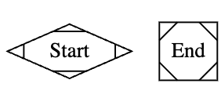
        </td>
        <td>The Start and end of the function are represented by 2 unique M shapes. MDiamond for "Start" and MSquare for "End".</td>
    </tr>
        <td>Function</td>
        <td>
            
        </td>
        <td>Each Function block is represented by an oval.</td>
    </tr>
        <td>Jobs</td>
        <td>
            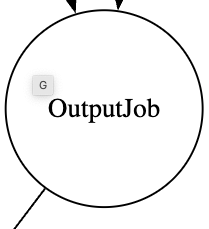
        </td>
        <td>Each job (loaded by the Shared Objects) is represented by a circle.</td>
    </tr>
        <td>Condition</td>
        <td>
            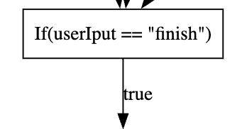
        </td>
        <td>Each condition block is represented by a rectangle. Either one or two edge will branch out and the label will differentiate if the comparison is true or false.</td>
    </tr>
        <td>Data Structure</td>
        <td>
            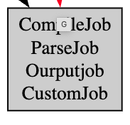
        </td>
        <td>Each data structure, in this example a map, is represented by a gray box.</td>
    </tr>
        <td>UI</td>
        <td>
            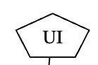
        </td>
        <td>User Interface.</td>
    </tr>

</table>

### Pointers

<table>
    <tr>
        <td>Progression Pointer</td>
        <td>
            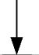
        </td>
        <td>The progression of the program by sequence.</td>
    </tr>
        <td>Red Pointer</td>
        <td>
            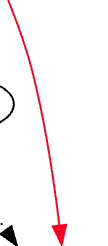
        </td>
        <td>Read pointer, in this case a function reading value from a data structure.</td>
    </tr>
        <td>Dot Pointer</td>
        <td>
            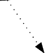
        </td>
        <td>Assignment pointer, in this case a function assigning value to a data structure.</td>
    </tr>
        <td>Bold Point</td>
        <td>
            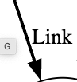
        </td>
        <td>Bold pointers entails dependencies. In this case OutputJob will not run until Compile Job finish. </td>
    </tr>
</table> 

### Structures
Structures combine different pointers and shapes to build a system of functionality.
<table>
    <tr>
        <td>For Loop</td>
        <td>
            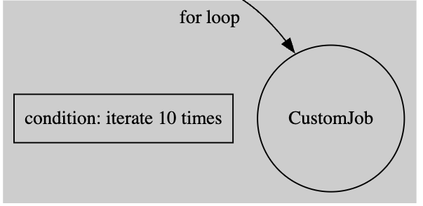
        </td>
        <td>A for loop can be a simple repeating iteration, or a certain contition (iteration, each statement, etc).</td>
    </tr>
        <td>While Loop</td>
        <td>
            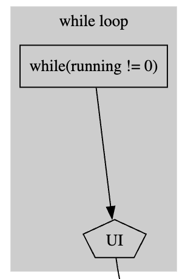
        </td>
        <td>A while loop contains a condition statement.</td>
    </tr>
        <td>Iteration</td>
        <td>
            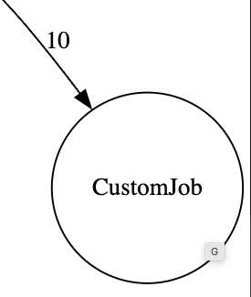
        </td>
        <td>Create the Job that is pointed the amount of times labeled.</td>
    </tr>

</table> 

## JobSystem Program
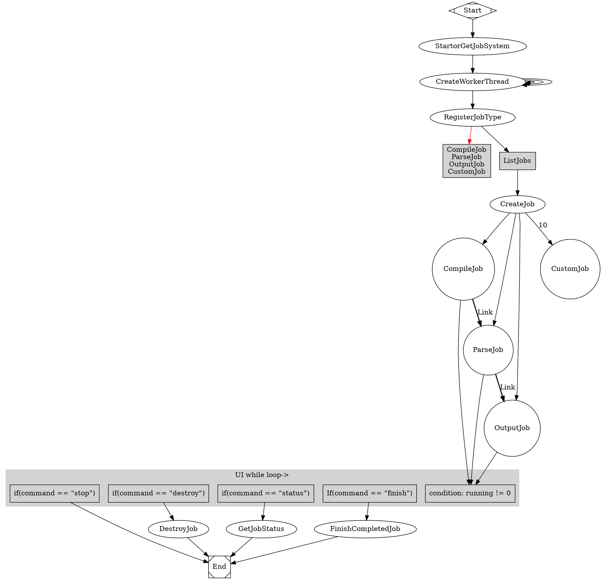